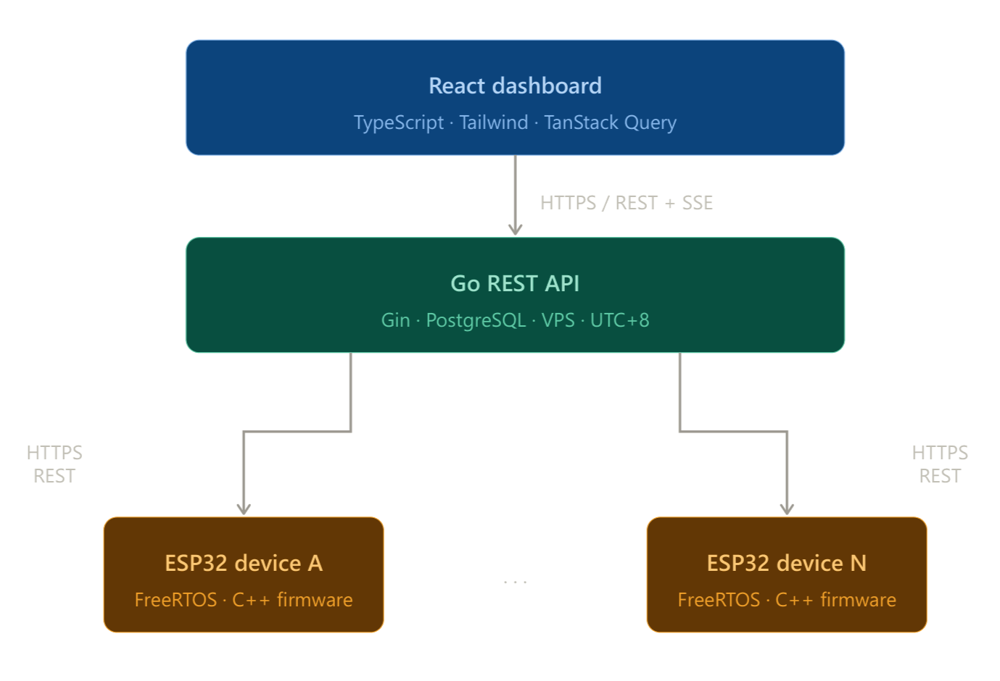

# Ozone IoT System

[](https://go.dev)
[](https://react.dev)
[](https://www.typescriptlang.org)
[](https://www.postgresql.org)
[](https://www.espressif.com)
[](https://platformio.org)

> Source code is private. This repository documents the system architecture and engineering decisions.

---

## Overview

Full-stack IoT platform for managing commercial ozone treatment machines across multiple outlet locations in Malaysia. In production with real paying users, including deployments at enterprise clients in the Malaysian automotive sector.

The system connects ESP32-powered hardware units to a Go REST API and a React dashboard — handling remote device management, timed treatment sessions, usage-based billing, and multi-outlet analytics from a single operator dashboard.

---

## System Architecture


```
┌─────────────────────────────────────┐
│         React Dashboard              │
│      (TypeScript · Tailwind)         │
└────────────────┬────────────────────┘
│ HTTPS / REST
┌────────────────▼────────────────────┐
│          Go REST API                 │
│      PostgreSQL · VPS · UTC+8        │
└──────┬──────────────────────┬───────┘
│ HTTPS REST            │ HTTPS REST
┌──────▼──────────┐  ┌────────▼───────────┐
│  ESP32 Device A │  │   ESP32 Device N    │
│  FreeRTOS       │  │   FreeRTOS          │
└─────────────────┘  └────────────────────┘
```

Each ESP32 controls a physical ozone machine at a customer outlet. Devices capture treatment events locally, upload them to the backend with retry logic, and poll for remote commands periodically.

---

## Tech Stack

| Layer | Technology |
|-------|-----------|
| Firmware | C++ / PlatformIO / FreeRTOS |
| MCU | ESP32 |
| Backend | Go / Gin / PostgreSQL |
| Frontend | React / TypeScript |
| Hosting | VPS / AlmaLinux |

---

## Key Features

**Device lifecycle management**
- Devices register and are held in a pending state until admin approval
- Approved devices receive auth tokens; unapproved devices cannot submit data
- Admin dashboard handles device approval, assignment, and remote command dispatch

**Timed treatment sessions**
- Multiple treatment tiers mapped to billing counters
- Hardware voltage monitoring to auto-stop sessions on power anomalies

**Remote command execution**
- Per-device command queue managed by the backend
- Supports device control, diagnostics, OTA firmware updates, and log retrieval

**Analytics and billing**
- Treatment events aggregated into daily, weekly, and monthly analytics
- Usage-based billing with admin-adjustable counters and audit trail

**Real-time dashboard**
- Server-Sent Events (SSE) stream pushes device state changes without polling

**Role-based access**
- Multiple access roles enforced at the API level

---

## Engineering Highlights

**Clock integrity across power loss**

ESP32 devices in field deployments lose power unpredictably. The firmware maintains a hardware RTC backed by a persisted last-known-good timestamp in non-volatile storage. On boot, if NTP sync is unavailable, the device falls back to this anchor rather than reporting an invalid time. Every event payload carries a clock source indicator so the backend can assess timestamp confidence and flag suspicious records.

**Durable event queue on constrained hardware**

Treatment events are persisted to local flash storage immediately on capture, before any network attempt. A background task drains this queue with exponential backoff and idempotency keys, ensuring no treatment is lost to a transient WiFi outage and no event is double-counted on retry.

**Decoupled firmware task architecture**

The firmware separates hardware control and network I/O into independent RTOS tasks across CPU cores. The treatment state machine runs entirely independently of network state — a WiFi outage never interrupts an active session. Inter-task communication uses lock-free queues.

**PostgreSQL time discipline**

All timestamps stored as timezone-aware. The backend operates at a fixed UTC+8 offset (Malaysia, no DST) rather than relying on server locale, avoiding midnight-boundary bugs common in systems that mix naive datetimes.

**TLS on a microcontroller**

All backend communication is over HTTPS with a pinned root certificate embedded in firmware. No plaintext fallback in production builds.

**Multi-level billing model**

Treatment data exists at two levels: an immutable append-only event log and admin-adjustable canonical counters. Billing derives from the canonical counters, with a full audit trail for corrections after hardware swaps or field incidents.

---

## Project Status

**Production** — deployed on a VPS running AlmaLinux, serving real paying users across multiple outlet locations in Malaysia.
